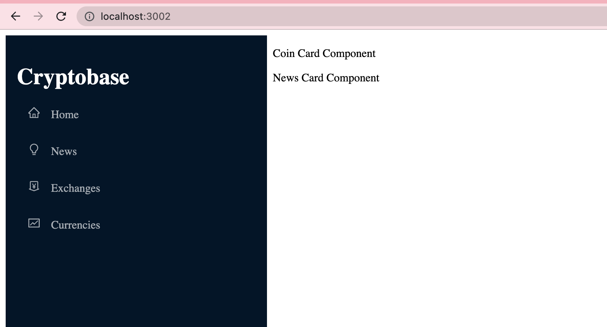

# Exercise 1 -  Create NewsCard component

## Before you start 
Run the following command in the root folder of your application
- `rm -rf node_modules`
- `rm -rf package-lock.json`
- `npm i`

Start your exercise once all these Commands are successful.
## Objective 
Create a news component as same way we crearted Currency component which will show show **News Card Component** text on UI. 
After completing this exercise you will be able to 

 - Creating a static React component.
 - Importing component and use it anywhere.

## Steps

 - Create a new file named **NewsCard.js** in the folder **Exercise1**
 - In that file, write the component code same way as we have written for file **Card.js** and replace the text **Card Component** with **'News Card Component'**.
 - Import the file **NewsCard.js** into file **Container.js.**
 - Write down the JSX tag of **NewsCard** component beside to **Card** component, as shown below
  `
 <Card/> <NewsCard/> 
`

## Expected Output
At the end of this exercise your output on browser should look like this 

## Running Test cases

To verify your output run the following command in the root folder of your directory `npm run test`
