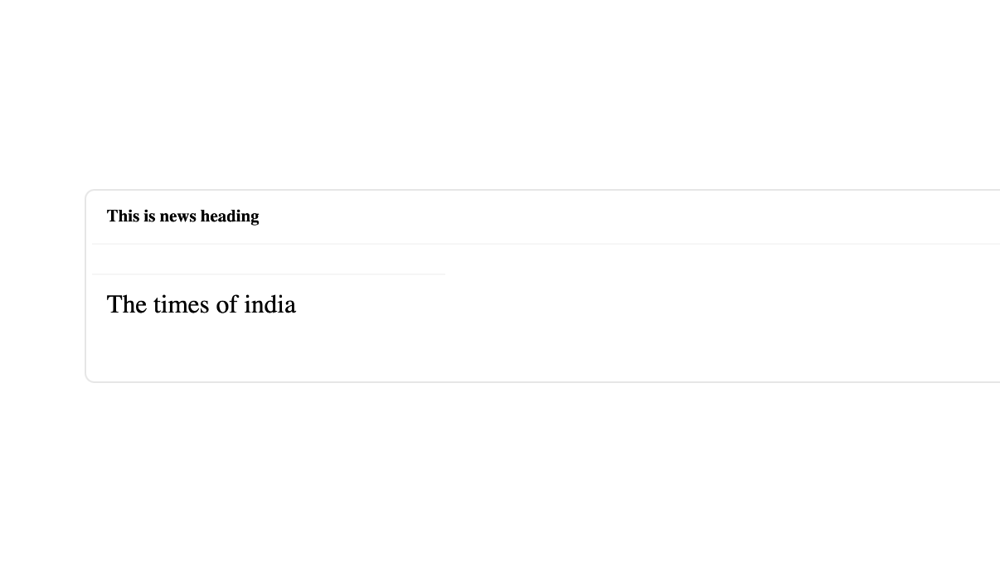
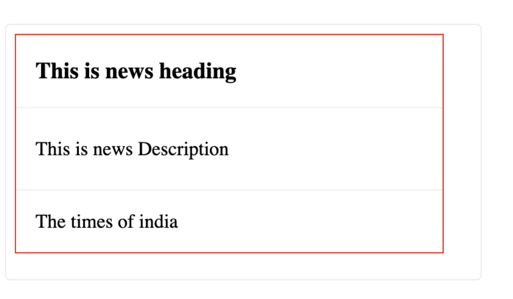

# Exercise 2 -  Props and Style addition to News Card Component
## Objective 
You are given an uncomplete news-card component. You have to Complete it by following the steps given.
There are 2 Objective you have to achieve to complete this exercise

 - Adding a description prop in NewsCard Component, to show the news description in NewsCard.
 - Adding missing classes and styling in NewsCard.
After completion of this exercise you will be able to :
	 - Add props to React component.
	 - Apply Styling to your custom component.

## Steps

 - Go to file **Exercise2/Container.js** and add create a variable with value  
	 - `const  newsDescription = "Archit Gupta, Founder & CEO Clear says the price of Bitcoin, the first and most prominent crypto, rose to $68,000 in November 2021. Shortly after, it nearly halved in price to $35,000 and continued to decline. Today it stands at around $21,000.";`
 - Paas this variable as prop named **description** to NewsCard Component in the following way.
	 - `<NewsCard  heading={newsHeading}  provider={newsProvider}  description = {newsDescription}  />`
 - Go to file **Exercise2/NewsCard.js**, and add the description to it on the description block
	 - `
 
 {description} 

`
 - Test if news Description is showing on screen.
 - Go to file **Exercise2/NewsCard.js**,  and apply newsContainer class to top level div.
	 - `
 ....`
	 - This should bring up the **red** border around news card.
 - Go to file **Exercise2/NewsCard.module.css**, and change the font-size for class **cardFooter**  to **16px**
 - `.cardFooter{ font-size:16px; }`

## input 

## Expected Output
At the end of this exercise your output on browser should look like this 

   

## Running Test cases

To verify your output run the following command in the root folder of your directory `npm run test`
