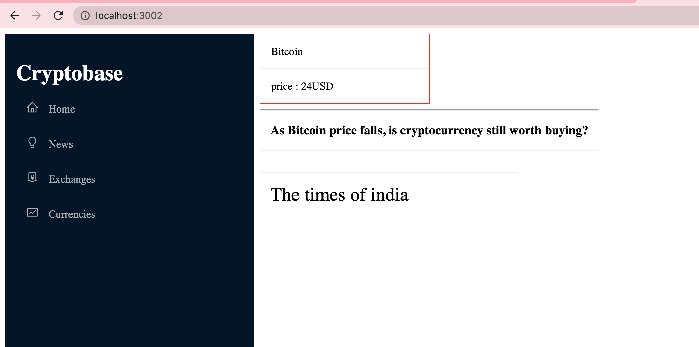

# Exercise 3 -  Introduction to State and and List rendering in react
## Objective 
Till Now we are rendering Coin Card components as a list. 
Complete rendering of News Card Component, same way as we have rendered Coin Card.
There are 2 Objective you have to achieve to complete this exercise

 - Adding News State in NewsCard component using useState and useEffect hooks.
 - Rendering News List in Top News Section

After completion of this exercise you will be able to :
	 - Add state using useState hook in your component.
	 - Rendering List from array in react.

## Steps

 - Go to file **App.js** and import **Exercise3/Container**
    -`import Container from "./Exercise3/Container";` 

 - Go to file **Exercise3/Container.js** you will find we have already imported **NewsCard** Component and **news**(newsData), on the top.  
	 - `import NewsCard from "./NewsCard";`
     - `import news from "../MockData/News.json";`

 - Initialise news List in a State, as the following way.
     - `const [newsList, setNewsList] = useState([]);`
 - Set your news State in in **useEffect** hook
	 - `setNewsList(news)`
 - In the second div after heading **Top News**, loop over the **newsList** in the following way
 `newsList.map((newsData)=>{
                         return <NewsCard heading={newsData.name} 
                         imageUrl ={newsData.imageUrl}
                         description = {newsData.description}
                         thumbnailURL = {newsData.thumbnailURL}
                         providerName = {newsData.providerName}
                          datePublished={newsData.datePublished} 
                          />
                    })
 `
 - Go to file **Exercise2/NewsCard.js**,  and apply container class to top level div.
	 - `
 ....`
	 - This should bring up the **red** border around news card.
 - Go to file **Exercise2/NewsCard.module.css**, and change the font-size for class **cardFooter**  to **16px**
 - `.cardFooter{ font-size:16px; }`

## input 

## Expected Output
At the end of this exercise your output on browser should look like this 

   

## Running Test cases

To verify your output run the following command in the root folder of your directory `npm run test`
